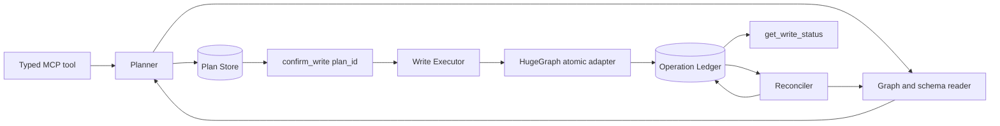
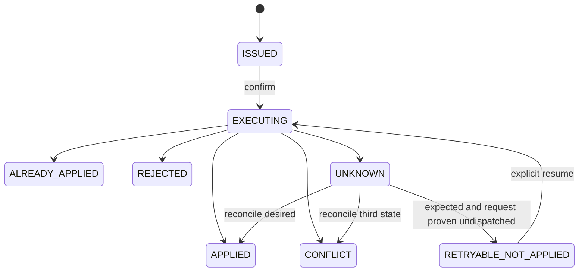

# Design: HugeGraph MCP Confirmed Write Safety

## 1. Overview

### 1.1 Goal

Build one coherent write model for HugeGraph MCP that can answer three independent questions:

1. What immutable intent did the user approve?
2. Did the database apply that intent atomically against the approved precondition?
3. What is the durable outcome after timeout, process crash, restart, or partial workflow progress?

The design covers the confirmed defects and the subsequent independent review. It replaces tool-specific confirmation and recovery behavior with a shared plan, execution, and reconciliation path.

### 1.2 Requirements source

The approved requirements are the defect and remediation package in `hugegraph-pr73-review.zip`, plus the findings verified against the current working tree:

- delete targets must be bound to stable backend IDs;
- edge creation must bind both endpoint IDs before the write;
- property mutation requires backend-enforced compare-and-set;
- ambiguous writes must become durable `UNKNOWN` outcomes;
- partial workflows must never be reported as rejected/no-op;
- schema plans contain exactly one create operation;
- raw Gremlin execution requires enforceable resource boundaries;
- configuration, public contracts, and documentation must match runtime behavior.

### 1.3 In scope

- A server-side immutable `WritePlan` and per-operation plan model.
- A durable plan/operation ledger with explicit state transitions.
- Stable endpoint binding for edge creation.
- Atomic execution adapters for supported operation kinds.
- Reconciliation for ambiguous outcomes.
- Explicit partial workflow semantics.
- Capability-gated property CAS and isolated vertex deletion.
- Typed timeout and query-budget configuration.
- Public confirm, status, and reconcile tools.
- Compatibility migration from the current nonce/hash API.
- Unit, fault-injection, concurrency, migration, and Docker integration tests.

### 1.4 Out of scope

- Pretending that a client mutex provides database atomicity.
- Implementing property CAS only in the MCP process.
- Claiming that a post-response byte check limits network or process memory.
- Automatic compensation for arbitrary graph workflows.
- Enabling writes across multiple MCP replicas while using independent SQLite files.

## 2. First-principles model

### 2.1 Authorization is an immutable server-side fact

The user approves a server-persisted plan identified by `plan_id`. The confirm request contains only `plan_id`. Target IDs, endpoint IDs, expected state, desired state, operation order, graph target, principal, and expiry are loaded from the plan store.

Hashes remain internal integrity fields. Client-supplied payloads never become the execution source after confirmation.

### 2.2 Atomicity belongs at the database boundary

Every operation has the form:

```text
for stable target T
if current state matches expected state E
atomically produce desired state D
```

An operation is executable only when HugeGraph can enforce its precondition and mutation in one transaction or one documented atomic server primitive. Unsupported operations remain preview-only and return `FEATURE_DISABLED` before consuming confirmation.

### 2.3 Outcome is based on evidence

Transport failure does not prove database failure. The system records what it knows:

- `APPLIED`: commit and desired state are proven.
- `ALREADY_APPLIED`: desired state was already present for the same operation identity.
- `REJECTED`: the backend proves no mutation occurred.
- `CONFLICT`: the approved precondition no longer holds.
- `PARTIAL`: at least one workflow operation is applied and at least one is not final.
- `UNKNOWN`: the request may have committed or execution was interrupted at an ambiguous point.

`UNKNOWN` and `PARTIAL` are never automatically retried.

### 2.4 Stable identity is operation-specific

- Vertex: graph target + vertex backend ID + label.
- Edge: graph target + edge backend ID, when available.
- New edge: source backend ID + edge label + target backend ID + sort-key values. A schema that permits indistinguishable duplicate edges additionally requires a caller-supplied idempotency key.
- Schema object: schema kind + name.
- Property replacement: target type + backend ID + operation ID.

Backend ID represents logical identity. Reuse of the same custom ID is treated as the same logical entity. Deployments requiring instance-level ABA protection must add a version property and include it in `expected_state`.

## 3. System architecture



### 3.1 Planner

The planner validates input and schema, resolves stable identities, calculates expected and desired states, resolves dependencies, and persists the final canonical plan. It performs no writes.

### 3.2 Plan store

The store owns immutable plans and mutable execution state. SQLite is the supported single-instance implementation. Multi-replica write deployments require a shared transactional implementation before writes are enabled.

### 3.3 Executor

The executor is the only MCP component permitted to call write adapters. It loads the exact persisted plan, atomically transitions the operation state, calls one adapter operation, and persists a receipt.

### 3.4 Reconciler

The reconciler reads the current database state for `UNKNOWN` or `PARTIAL` operations and derives a new evidence-backed state. It never infers success from an exception class.

## 4. Data model

### 4.1 Write plan

```python
@dataclass(frozen=True)
class WritePlan:
    plan_id: str
    tool_name: str
    graph_target: GraphTarget
    principal: str
    operations: tuple[OperationPlan, ...]
    payload_digest: str
    schema_fingerprint: str | None
    status: PlanStatus
    created_at: int
    expires_at: int
```

```python
@dataclass(frozen=True)
class OperationPlan:
    operation_id: str
    kind: OperationKind
    target: dict[str, Any]
    expected_state: dict[str, Any]
    desired_state: dict[str, Any]
    depends_on: tuple[str, ...]
    idempotency_key: str | None
```

### 4.2 Receipt

```python
@dataclass(frozen=True)
class ApplyReceipt:
    plan_id: str
    operation_id: str
    status: ApplyStatus
    observed_state: dict[str, Any] | None
    reason_code: str | None
    attempt: int
    reconciliation_required: bool
    committed_at: int | None
```

### 4.3 SQLite schema

```sql
CREATE TABLE write_plans (
    plan_id TEXT PRIMARY KEY,
    tool_name TEXT NOT NULL,
    graph_target_json TEXT NOT NULL,
    principal TEXT NOT NULL,
    payload_json TEXT NOT NULL,
    payload_digest TEXT NOT NULL,
    schema_fingerprint TEXT,
    status TEXT NOT NULL,
    created_at INTEGER NOT NULL,
    expires_at INTEGER NOT NULL,
    confirmed_at INTEGER
);

CREATE TABLE write_operations (
    operation_id TEXT PRIMARY KEY,
    plan_id TEXT NOT NULL,
    ordinal INTEGER NOT NULL,
    kind TEXT NOT NULL,
    payload_json TEXT NOT NULL,
    status TEXT NOT NULL,
    attempt INTEGER NOT NULL DEFAULT 0,
    receipt_json TEXT,
    updated_at INTEGER NOT NULL,
    UNIQUE(plan_id, ordinal),
    FOREIGN KEY(plan_id) REFERENCES write_plans(plan_id)
);
```

The store has an explicit schema version and additive migrations. Legacy consumed confirmations without an operation receipt migrate to `LEGACY_UNKNOWN`, never to `REJECTED` or `APPLIED`.

## 5. State machines

### 5.1 Operation state



The transition from `ISSUED` to `EXECUTING` and attempt increment occur in one plan-store transaction. A process crash after this transition is exposed as `UNKNOWN` on status read.

### 5.2 Workflow state

```text
all operations APPLIED/ALREADY_APPLIED -> APPLIED
some final success + some non-final/failure -> PARTIAL
no side effect and deterministic refusal -> REJECTED or CONFLICT
any ambiguous operation and no known partial success -> UNKNOWN
```

`PARTIAL` includes `written`, `not_applied`, and `unknown` operation sets. It is never collapsed into `REJECTED`.

## 6. Operation design

### 6.1 Create vertex

Planner:

- validate the label and property map;
- require a stable explicit/custom ID or deterministic primary-key identity;
- persist `expected_state={exists: false}` and the complete desired vertex.

Executor:

- create one vertex by stable identity;
- treat an identical existing vertex as `ALREADY_APPLIED`;
- treat an existing different vertex as `CONFLICT`.

If the backend cannot atomically create-if-absent for the identity, concurrent correctness remains capability-gated.

### 6.2 Create edge

Planner resolves each endpoint to one of:

- an existing backend vertex ID; or
- a dependency reference to an earlier `CREATE_VERTEX` operation.

The executor replaces dependency references with the persisted vertex receipt ID. The final write request uses only:

```groovy
g.V(sourceId).as('s').V(targetId).addE(label).from('s')
```

No property predicate is evaluated during the write. Before execution, both IDs must exist with the planned labels. Edge identity includes sort keys or an explicit idempotency key.

### 6.3 Delete edge

Planner resolves and persists the edge ID. Executor deletes by edge ID. Missing ID reconciles to `ALREADY_APPLIED`; an incompatible target resolves to `CONFLICT`.

### 6.4 Delete isolated vertex

The required atomic primitive is:

```text
delete_vertex_if_no_incident_edges(vertex_id, label)
```

The existing single Gremlin traversal may be used only after concurrency tests prove the required behavior for every supported HugeGraph backend. Otherwise the operation remains disabled until HugeGraph exposes a narrow server API.

### 6.5 Replace properties

Append/eliminate commands are compiled into complete state replacement:

```text
expected properties -> desired properties
```

The adapter contract is:

```python
replace_properties_if_match(
    target_type,
    target_id,
    expected_properties,
    desired_properties,
    operation_id,
) -> ApplyReceipt
```

This requires a backend-enforced CAS or equivalent transaction with an element/version lock. The public mutation tool stays preview-only until the capability is available.

### 6.6 Schema create

One plan contains one schema create. The executor uses the configured write timeout and treats outcomes as follows:

- identical object exists: `ALREADY_APPLIED`;
- different object with the same name: `CONFLICT`;
- create succeeds and post-read matches: `APPLIED`;
- manager construction, transport, response parsing, or post-read is ambiguous: `UNKNOWN` with a persisted receipt.

The schema-manager construction is inside the same exception boundary as the request.

### 6.7 Graph import workflow

Graph import is a durable dependency graph:

```text
CREATE_VERTEX operations -> CREATE_EDGE operations
```

Each operation has its own receipt. Vertices persist their resulting backend IDs. Edges consume those IDs. A failure produces `PARTIAL` when any earlier operation is applied. Resume first reconciles every non-final operation and then executes only proven-not-applied operations.

If a future HugeGraph API provides a true batch transaction, the adapter may execute the same immutable operation set transactionally without changing the public plan contract.

## 7. API design

### 7.1 Dry run

```json
{
  "ok": true,
  "data": {
    "plan_id": "wp_...",
    "status": "ISSUED",
    "expires_at": 1788500000,
    "preview": {},
    "confirmable": true
  }
}
```

Preview-only operations return `confirmable=false` and no confirm token.

### 7.2 Confirm

```text
confirm_write_tool(plan_id)
```

The tool atomically claims the plan and returns its current receipt. Repeated confirm calls return the persisted current state; they do not create a second attempt.

### 7.3 Status

```text
get_write_status_tool(plan_id)
```

Returns the plan status and ordered operation receipts without exposing the stored mutation payload.

### 7.4 Reconcile

```text
reconcile_write_tool(plan_id)
```

Only `UNKNOWN`, `PARTIAL`, and legacy unknown plans are eligible. Reconciliation is read-only and idempotent. Observing the expected state does not authorize retry after an operation was dispatched: the old request may still commit later. `RETRYABLE_NOT_APPLIED` is available only when the durable operation record proves that no adapter attempt was claimed, or when a backend-enforced idempotency/fencing primitive proves replay safety.

### 7.5 Compatibility

For one release, existing tool parameters `plan_hash`, `nonce`, and `expires_at` are accepted only as locators and integrity checks. Execution always loads the server plan. Responses include a deprecation warning and `plan_id`.

## 8. Error and status mapping

| Condition | Error type | Durable status | Retryable |
|---|---|---|---|
| Validation before confirmation | `VALIDATION_ERROR` | none | false |
| Expected state changed | `WRITE_CONFLICT` | `CONFLICT` | false |
| Backend proves no write | operation-specific error | `REJECTED` | false |
| Request may have committed | `WRITE_OUTCOME_UNKNOWN` | `UNKNOWN` | false |
| Some operations committed | `PARTIAL_APPLY` | `PARTIAL` | false |
| Feature lacks atomic primitive | `FEATURE_DISABLED` | none | false |

No error emitted after a possible write recommends replaying the public tool.

## 9. Configuration and resource safety

### 9.1 Typed configuration

Configuration is parsed through field specifications with type, default, minimum, and maximum. Integer fields use integer comparisons and never pass arbitrary-precision values through `math.isfinite`. Float fields reject non-finite values and catch overflow.

Read and write adapters explicitly choose `read_timeout_seconds` or `write_timeout_seconds`. Schema create uses the write timeout.

### 9.2 Raw Gremlin

Default Agent access uses typed query tools. Raw execution remains disabled by default.

Enabling raw execution requires all of:

- explicit admin/debug feature flag;
- a distinct read-only HugeGraph principal;
- a server-side evaluation timeout;
- a server-side result-count cap or enforced traversal cap;
- an HTTP streaming response reader that aborts after the configured byte limit.

The current post-materialization count/byte check remains a final output guard. It is not advertised as a hard execution or memory budget.

### 9.3 Upstream envelope normalization

Nested Thin API envelopes are unwrapped iteratively with a small fixed depth limit. Excess depth or malformed shapes return a structured upstream-response error.

## 10. Failure recovery

### 10.1 Reconciliation rules

- Create vertex: desired exact state -> `APPLIED`; absent and never dispatched -> `RETRYABLE_NOT_APPLIED`; absent after dispatch -> `UNKNOWN`; other state -> `CONFLICT`.
- Create edge: stable edge identity present -> `APPLIED`; absent and never dispatched -> `RETRYABLE_NOT_APPLIED`; absent after dispatch -> `UNKNOWN`; ambiguous duplicate identity -> `CONFLICT`.
- Delete: stable ID absent -> `APPLIED`; present and never dispatched -> `RETRYABLE_NOT_APPLIED`; present after dispatch -> `UNKNOWN` unless backend replay safety is proven; incompatible state -> `CONFLICT`.
- Replace properties: current equals desired -> `APPLIED`; current equals expected and never dispatched -> `RETRYABLE_NOT_APPLIED`; current equals expected after dispatch -> `UNKNOWN`; otherwise -> `CONFLICT`.
- Schema create: identical object -> `APPLIED`; missing and never dispatched -> `RETRYABLE_NOT_APPLIED`; missing after dispatch -> `UNKNOWN`; same name with different fields -> `CONFLICT`.

### 10.2 Crash points

The design explicitly tests crashes:

1. before plan claim;
2. after `EXECUTING` persistence and before adapter call;
3. after request send and before response;
4. after response and before receipt persistence;
5. after receipt persistence and before response to the caller.

Each restart produces a queryable durable state. Only reconciliation can authorize another attempt.

## 11. Testing strategy

### 11.1 Unit and contract tests

- Plan canonicalization and immutable payload loading.
- Legal and illegal state transitions.
- SQLite schema migration and corrupted-row fail-closed behavior.
- Partial workflow aggregation.
- Huge integer and non-finite configuration values.
- FLOAT/DOUBLE overflow input.
- Bounded nested-envelope normalization.
- Correct read/write timeout selection.
- Public response and deprecation contracts.

### 11.2 Concurrency tests

- Predicate expands after edge planning; exactly one edge is created between bound endpoint IDs.
- Two property replacements share one expected version; at most one applies.
- An edge is added while isolated-vertex deletion executes; either the edge and vertex survive with conflict, or deletion wins before edge creation. No dangling or silently cascaded state is allowed.
- Two confirmers claim the same operation; one adapter attempt occurs.

Tests use barriers or backend fault hooks, not sleeps.

### 11.3 Fault injection

Inject failure at every crash point and assert the persisted operation state, public error, and reconciliation result.

### 11.4 Docker integration

Run against HugeGraph 1.7.0 for every supported backend configuration. The suite verifies database state and ledger state together, including `get_write_status_tool` after partial and unknown outcomes.

## 12. Key decisions and trade-offs

### Decision A: Keep a multi-operation plan, execute it as a durable workflow

Reason: imports naturally contain dependent vertices and edges. A per-operation ledger makes partial progress explicit and recoverable.

Trade-off: more persistence and reconciliation logic than rejecting every batch. The public semantics become honest and deterministic.

### Decision B: Bind edge endpoints to IDs before the edge write

Reason: a uniqueness check followed by predicate-based creation cannot prevent concurrent fan-out.

Trade-off: newly created vertices must return and persist their IDs before dependent edges execute.

### Decision C: Capability-gate unsupported atomic writes

Reason: user confirmation and process-local locking cannot substitute for backend CAS or transactional conditional deletion.

Trade-off: property mutation remains unavailable until HugeGraph supplies the required primitive.

### Decision D: Separate `PARTIAL` from `UNKNOWN` and `REJECTED`

Reason: recovery behavior depends on whether any side effect is already proven.

Trade-off: callers must handle one additional durable state.

### Decision E: Make SQLite a declared single-instance implementation

Reason: independent SQLite files cannot enforce one-shot confirmation across replicas.

Trade-off: multi-replica write deployments need a shared PlanStore implementation.

## 13. Risks and mitigations

- Backend transaction semantics differ by storage backend. Mitigation: capability matrix and backend-specific Docker concurrency tests before enabling each atomic adapter.
- Legacy callers may assume retryable transport errors. Mitigation: compatibility response warnings and explicit status/reconcile guidance.
- Ledger growth may become unbounded. Mitigation: retain final receipts for a configured audit period; never delete active `UNKNOWN` or `PARTIAL` records automatically.
- Raw Gremlin can exhaust server or client resources. Mitigation: remain disabled until all hard-budget capabilities are present.
- Documentation can diverge from behavior. Mitigation: contract tests assert tool count, arguments, status enums, defaults, and generated README tables where practical.

## 14. Acceptance criteria

The design is complete when all of the following are demonstrated:

1. Edge creation never re-evaluates endpoint predicates during a write.
2. Every confirmed write has a durable, queryable operation record before the adapter call.
3. Partial workflows are returned and stored as `PARTIAL_APPLY`/`PARTIAL`.
4. No ambiguous result is directly retryable.
5. Property mutation stays disabled until backend CAS passes concurrency tests.
6. Schema manager creation, request, response, and verification share one UNKNOWN boundary and use write timeout.
7. Raw Gremlin is disabled unless hard server and client budgets are available.
8. Documentation and public contract tests match the runtime behavior.
9. Unit, migration, fault-injection, and Docker concurrency suites pass.
