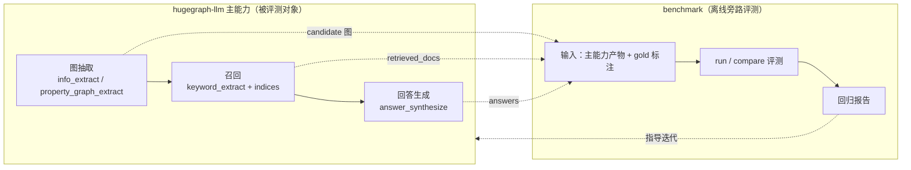
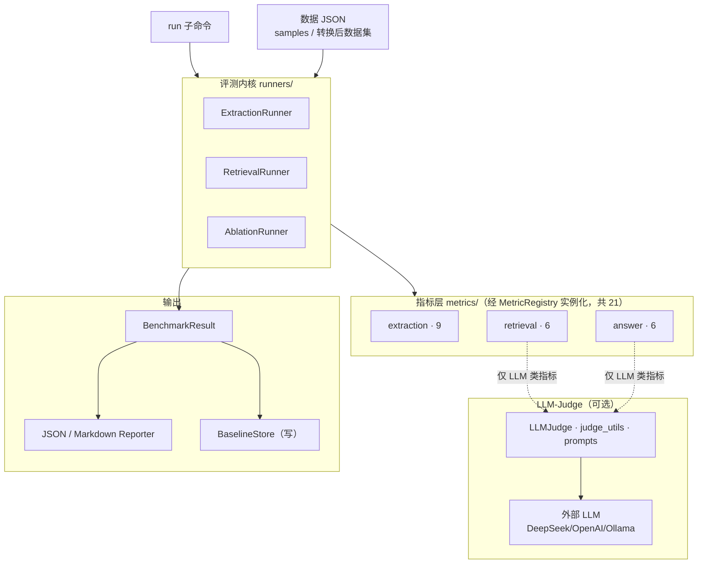
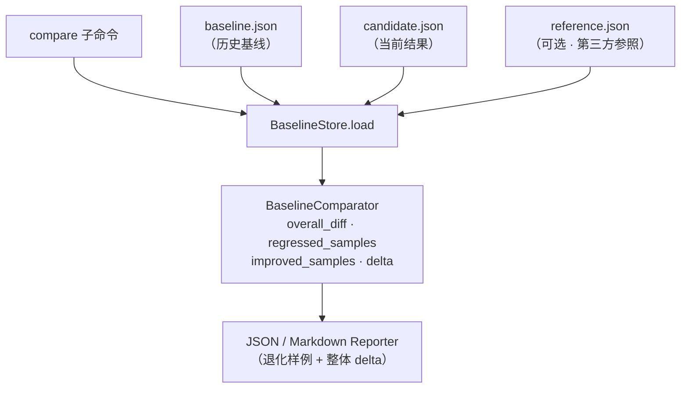
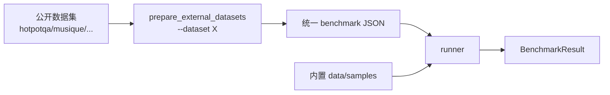
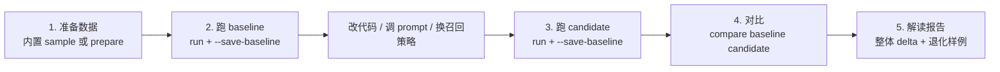
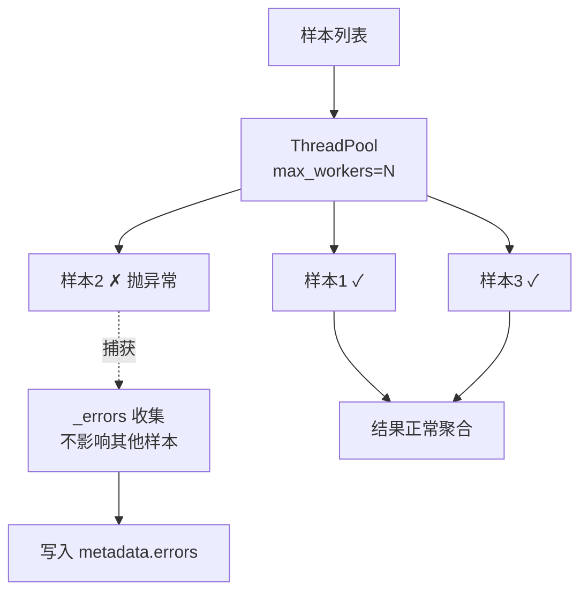
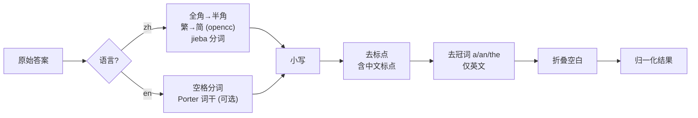
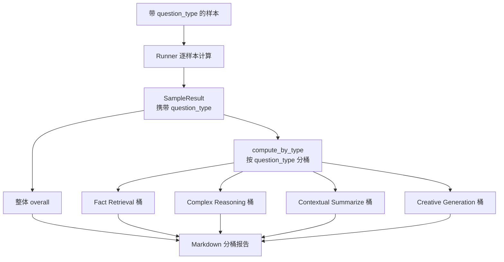

# HugeGraph-LLM GraphRAG Benchmark 评测能力

> **文档定位**：面向 Issue [#75](https://github.com/hugegraph/hugegraph-ai/issues/75) 的设计与实现交付文档，可作为内部分享与上手手册使用。
> **适用版本**：`feat/graphrag-benchmark-issue7` 分支（本地，未推送）
> **维护团队**：HugeGraph-LLM

---

## 一、一句话定位

HugeGraph-LLM 自带了一套**轻量、可复现、中文友好、不强依赖外部 LLM** 的 GraphRAG 评测能力，覆盖**图抽取 / 召回 / 答案生成三大维度**（对标 GraphRAG-Bench 的 indexing / retrieval / generation 全链路；其中答案生成维度通过 ablation 模式对比四种召回策略的端到端影响），并支持 baseline 持久化、candidate 对比、按任务难度分层报告。整套能力以一个 CLI 子命令暴露，开箱即用。

> [!IMPORTANT]
> 这套 benchmark 的设计哲学是 **"先能用、可对照、可复现"**，而不是"重造一个 RAGAS"。因此它复用了业内成熟思路（RAGAS / GraphRAG-Bench / MRQA），但把外部依赖压到最低——**基础评测（抽取 P/R/F1、召回 Recall@K/MRR、Token-F1 等）在纯离线模式下即可完成**，LLM-as-Judge 是可选增强项。

---

## 二、Issue #75 验收清单对照

下表逐条核实 Issue #75 的核心检查项。**12 项全部满足**。

| # | 验收要求 | 状态 | 交付物 |
|---|---------|------|-------|
| 1 | 调研已有 RAG/GraphRAG 评测方案并说明利弊 | ✅ | 调研了 RAGAS / DeepEval / ARES / TruLens / GraphRAG-Bench 五家，见 §三 |
| 2 | 可通过命令行运行 GraphRAG benchmark | ✅ | `hugegraph-benchmark run --mode {extraction,retrieval,ablation,all}` |
| 3 | 评估图抽取质量（完整性 + 正确性） | ✅ | 9 个 extraction 指标，见 §五 |
| 4 | 评估召回质量 | ✅ | 6 个 retrieval 指标（Recall@K / Hit@K / MRR / Context Precision / Context Relevancy / Evidence Recall），见 §五 |
| 5 | 可保存运行结果作为 baseline | ✅ | `--save-baseline`，含 git commit / timestamp / 并发度等元数据，见 §十 |
| 6 | 可比较 baseline / candidate / 参考答案 | ✅ | `compare` 子命令，输出 overall_diff / regressed / improved / delta，支持三方对照 |
| 7 | 输出 JSON 和 Markdown 报告 | ✅ | `--format {json,markdown}`；Markdown 适配 PR/Issue 评论 |
| 8 | 至少一组图抽取样例 | ✅ | `data/samples/extraction_sample.json`（英文）+ `car_extraction_sample.json`（中文汽车手册）|
| 9 | 至少一组召回样例 | ✅ | `data/samples/retrieval_sample.json` |
| 10 | 样例覆盖中文和英文 | ✅ | 中文抽取样例 + 中文召回样例 + 全指标 `language` 参数 + 中文归一化管线，见 §九 |
| 11 | 报告含失败/退化样例，不只平均分 | ✅ | `compare` 输出 sample 级 regressed/improved；运行时 `_errors` 收集失败样本，见 §八 |
| 12 | 文档说明新增 case / 运行 / 比较 / 解读 | ✅ | 本文档 §七（使用）、§十三（扩展）、§十四（报告解读）|

> [!TIP]
> 在 Issue #75 基础要求之外，本模块额外实现了以下工程能力：**样本级并发执行**、**按 question_type 难度分层报告**、**Coverage 指标**、**JSON 5 策略自愈解析**、**中英文双语归一化与 prompt**。详见 §八～§十二。

---

## 三、背景调研与方案选型

调研了 5 个主流开源评测框架，其能力与适配性如下：

| 框架 | 定位 | 优势 | 对本项目的不足 |
|------|------|------|---------------|
| **RAGAS** | 通用 RAG 评测事实标准 | 30+ 成熟指标、社区大、设计范式被广泛借鉴 | 核心指标（faithfulness / context precision 等）依赖 LLM-as-Judge；prompt 以英文为主，无中文专项；通用 RAG 指标，无图抽取维度 |
| **DeepEval** | 单元测试风格 RAG 评测 | CI/CD 友好、metric 即目录、执行模式丰富 | 以 pytest 测试用例为核心范式（需写 Python 测试代码，非 CLI 批跑）；无图抽取指标 |
| **ARES** | 无监督 RAG 评测 | 无需 golden answer，合成 query | 研究导向代码，工程化程度较低；指标集中在 context relevance / faithfulness 等少数几项；无图抽取维度 |
| **TruLens** | RAG 可观测 + 评测 | feedback 机制、dashboard | 定位偏运行时追踪（trace + feedback），非批跑 benchmark；依赖较重 |
| **GraphRAG-Bench** | GraphRAG 专用 benchmark | 覆盖图构建/检索/生成全链路；带 4 级任务难度；有 leaderboard | 评测对象是完整 GraphRAG pipeline（端到端），而非组件级质量；judge 链路基于 LangChain + Ollama 抽象；图构建仅评结构指标，无抽取质量细分 |

> [!NOTE]
> **选型结论**：不直接依赖上述任何一家，而是**借鉴其设计、自建轻量内核**。具体借鉴点：
> - 指标定义与 prompt 风格 ← RAGAS / GraphRAG-Bench
> - 文本归一化标准 ← HippoRAG 2 的 MRQA 官方评测 `eval_utils`
> - 任务难度分层（question_type）← GraphRAG-Bench
> - JSON 自愈解析 ← GraphRAG-Bench `JSONHandler` 思路
>
> **自建的理由**：上述框架都不评测"图抽取质量"（vertex/edge/property/schema），而这正是 GraphRAG 区别于普通 RAG 的核心；同时它们多数对中文不友好或强依赖外部 LLM，与 Issue 的"轻量、中文友好、不强依赖 LLM"要求冲突。

---

## 四、系统架构

### 4.1 与主系统的关系

benchmark 是 hugegraph-llm 的**离线旁路评测模块**——不侵入主 GraphRAG pipeline，而是读取主能力（图抽取 / 召回 / 回答生成）的产物，与 gold 标注做对照，把回归报告反馈给开发者，用于判断"改了抽取 / 召回 / 生成逻辑后效果是否变好"。



### 4.2 内部架构与数据流

benchmark 的两条 CLI 流相互独立：`run` 跑评测并产出结果，`compare` 读历史结果做版本回归对比（不经 runner / metric）。分两张图说明。`BaselineStore` 是两条流的衔接点——`run` 写、`compare` 读。

#### run —— 一次评测的执行流

三个 Runner 均继承 `BaseRunner`（并发 / 错误隔离 / 分桶，属代码层细节、图中省略）。实线为数据流，虚线为 LLM-Judge 可选依赖。



#### compare —— 版本回归对比（旁路）



模块职责（目录即职责，与 RAGAS / DeepEval 的"职责即目录"哲学一致）：

| 目录 | 职责 |
|------|------|
| `runners/` | 编排：加载数据 → 实例化 metric → 并发跑 sample → 聚合结果 |
| `metrics/{extraction,retrieval,answer}/` | 指标实现，按作用对象分组，自注册到 registry |
| `llm_judge/` | LLM 评审抽象、双语 prompt、retry、JSON 自愈 |
| `datasets/` | 公开数据集 → 统一 benchmark 格式的转换器 |
| `models/` | 结果数据模型（Pydantic）|
| `reporters/` | JSON / Markdown 报告生成 |
| `baseline/` | baseline 持久化 + candidate 对比 |
| `utils/` | 文本归一化（中英文）|

---

## 五、测试指标体系

整套指标共 **21 个**，按"评测对象"分为三组。每个指标明确标注是否依赖 LLM——**不依赖 LLM 的指标在纯离线模式下即可计算**，这是 Issue #75"不强依赖外部 LLM"要求的落地。

> 🔵 = 依赖 LLM-as-Judge（可选）；其余为纯离线指标。

### 5.1 图抽取质量指标（extraction，9 个）

这组指标针对 GraphRAG 的图结构产物做质量评测，而 RAGAS / DeepEval 等通用 RAG 框架只覆盖检索与生成、不评测图抽取。对照 Issue #75 给出的评估维度如下：

| Issue 维度 | 对应指标 | 含义 | LLM |
|-----------|---------|------|-----|
| Syntax Validity | `syntax_validity` | LLM 抽取输出的 JSON 可解析率、入库成功率 | 否 |
| Schema Validity | `schema_validity` | 类型约束通过率、必填属性填充率、非法边比例 | 否 |
| —（结构完整性）| `structural_integrity` | 孤立点 / 悬挂边 / 重复三元组检测 | 否 |
| Entity Quality | `entity_f1` | 实体 P / R / F1（对照 gold vertices）| 否 |
| Relation Quality | `triple_f1` | 三元组 P / R / F1（对照 gold edges）| 否 |
| —（属性质量）| `property_f1` | 属性 P / R / F1 | 否 |
| Claim Quality | `conflict_detection` | 实体/关系冲突检测 | 🔵 |
| Claim Quality | `temporal_validity` | 时序一致性（事件先后矛盾）| 🔵 |
| —（图结构质量）| `graph_structure` | 密度 / 聚类系数 / 连通性（对标 GraphRAG-Bench indexing 指标）| 否 |

> [!NOTE]
> Issue mermaid 中的 **Provenance Quality**（source span / doc attribution）属于"后续扩展"维度，Issue 本身也写明"基础能力优先覆盖完整性和正确性，后续逐步扩展"，因此当前版本未实现，预留了扩展点（§十三）。

### 5.2 召回质量指标（retrieval，6 个）

| 指标 | 含义 | LLM | 对照 Issue |
|------|------|-----|-----------|
| `recall_at_k` | 各 K 截断下的证据召回率 | 否 | "是否召回了应有证据" |
| `hit_at_k` | hit_any / hit_all @K | 否 | 同上 |
| `mrr` | 第一个相关文档的倒数排名 | 否 | — |
| `context_precision` | 检索结果中相关内容精确率 | 🔵 | "召回内容是否有效" |
| `context_relevancy` | 检索上下文与问题的相关度 | 🔵 | 同上 |
| `evidence_recall_llm` | LLM 判定证据是否被覆盖 | 🔵 | 更柔性的证据覆盖判定 |

### 5.3 答案质量指标（answer，6 个）

用于 Ablation 模式（4 种检索/生成模式的答案对比）以及分层评测。

| 指标 | 含义 | LLM |
|------|------|-----|
| `token_f1` | Token 级 P/R/F1（MRQA 标准）| 否 |
| `exact_match` | 归一化后精确匹配 | 否 |
| `rouge_l` | ROUGE-L（`rouge_score` 库）| 否 |
| `answer_correctness` | TP/FP/FN 分类 F1（±语义相似度）| 🔵 |
| `faithfulness` | 答案是否忠实于上下文（NLI）| 🔵 |
| `coverage` | 参考答案事实被覆盖比例（对标 GraphRAG-Bench coverage）| 🔵 |

> [!TIP]
> 文本与实体匹配类指标（`token_f1` / `exact_match` / `rouge_l` / `entity_f1` / `triple_f1` / `property_f1`）走 §九 的 `normalize_answer`，召回类（`recall_at_k` / `hit_at_k` / `mrr`）走 `normalize_doc_id`，按 `--language` 切换对应策略（英文：小写 + 去冠词 + 空格分词；中文：全半角统一 + 简繁归一 + jieba 分词），目的是消除大小写、全半角、繁简体、中文标点等格式差异造成的假阴性。图结构校验类指标（schema / syntax / structural / graph_structure）不涉及文本归一化。

---

## 六、数据集支持

### 6.1 内置样例（开箱即用）

`data/samples/` 下提供 5 组样例，覆盖三种评测模式——图抽取（extraction）、召回（retrieval）、生成回答（ablation）——以及中英文：

| 文件 | 模式 | 语言 | 样本数 |
|------|------|------|-------|
| `extraction_sample.json` | extraction（图抽取）| 英文 | 3 |
| `car_extraction_sample.json` | extraction（图抽取）| **中文（汽车手册）** | 2 |
| `retrieval_sample.json` | retrieval（召回）| 英文 | 3 |
| `chinese_retrieval_sample.json` | retrieval（召回）| **中文（汽车手册）** | 2 |
| `ablation_sample.json` | ablation（生成回答对比）| 英文 | 2 |

> [!NOTE]
> **生成回答样例即 `ablation_sample.json`**：每条样本携带同一问题在四种召回策略下的生成答案（`raw_answer` / `vector_only_answer` / `graph_only_answer` / `graph_vector_answer`）与 `gold_answer`，用 answer 类指标对照打分——这正是 GraphRAG"生成"维度的评测入口（详见 §6.3 的 ablation 格式与 §5.3 的 answer 指标）。

### 6.2 公开数据集转换器（8 个，4 组）

`datasets/prepare_external_datasets.py` 提供一键转换器，把公开数据集转成统一 benchmark 格式。**转换器不发明数据**——只做格式映射。

公开数据集的原始字段、转换规则、规模统计和真实跑测选型建议，单独整理在 [`BENCHMARK_DATASETS.md`](./BENCHMARK_DATASETS.md)。

| 组 | 数据集 | 用途 | question_type |
|----|--------|------|--------------|
| Multi-hop QA | `hotpotqa` / `2wikimultihopqa` / `musique` | 召回评测（多跳问答）| — |
| 匿名 RAG | `anonyrag-chs`（中）/ `anonyrag-eng`（英）| 召回评测，含中文 | — |
| GraphRAG-Bench | `graphrag-bench-medical` / `graphrag-bench-novel` | 召回 + **难度分层** | ✅ 4 类 |
| KG 抽取 | `text2kgbench` | 图抽取评测 | — |

> [!IMPORTANT]
> `graphrag-bench-medical` / `graphrag-bench-novel` 自带 **4 类任务难度标签**（Fact Retrieval / Complex Reasoning / Contextual Summarize / Creative Generation），转换器会保留 `question_type` 字段，触发 §十一 的分层报告。medical 2062 题、novel 2010 题。

### 6.3 数据格式规范

三种模式各自有明确的 JSON schema。**所有字段都是可选容错的**（缺字段不会崩，详见 §八）。

**extraction 模式**（对照 gold 图评 candidate 图）：
```json
{
  "schema": {"vertexlabels": [...], "edgelabels": [...]},
  "samples": [
    {
      "sample_id": "ext_001",
      "input_text": "原文…",
      "gold_vertices": [{"name": "…", "label": "…"}],
      "gold_edges": [{"out": "…", "in": "…", "label": "…"}],
      "candidate_vertices": [...],
      "candidate_edges": [...]
    }
  ]
}
```

**retrieval 模式**（对照 gold_docs 评 retrieved_docs）：
```json
{
  "samples": [
    {
      "sample_id": "ret_001",
      "question": "问题",
      "gold_docs": ["doc1", "doc2"],
      "retrieved_docs": ["doc1", "doc3", ...],
      "gold_answer": "（可选，供 answer 指标用）",
      "question_type": "（可选，触发分层）"
    }
  ]
}
```

**ablation 模式**（4 种检索/生成模式的答案对比）：
```json
{
  "samples": [
    {
      "sample_id": "abl_001",
      "question": "问题",
      "gold_answer": "标准答案",
      "raw_answer": "无 RAG 的基线答案",
      "vector_only_answer": "仅向量召回的答案",
      "graph_only_answer": "仅图召回的答案",
      "graph_vector_answer": "图+向量混合的答案",
      "question_type": "（可选，触发分层）"
    }
  ]
}
```



---

## 七、使用指南

### 7.1 环境准备

```bash
cd hugegraph-ai/hugegraph-llm
uv sync --extra llm            # 创建 .venv 并安装依赖
source .venv/bin/activate
```

LLM-Judge（可选）通过 `.env` 配置 OpenAI 兼容端点（DeepSeek / OpenAI / 本地皆可）：
```bash
OPENAI_CHAT_API_KEY=sk-...
OPENAI_CHAT_API_BASE=https://api.deepseek.com/v1   # 可选
OPENAI_CHAT_LANGUAGE_MODEL=deepseek-chat            # 可选
```

> [!NOTE]
> 不配置 LLM 时，加 `--offline` 跑纯离线指标（抽取 P/R/F1、召回 Recall@K、Token-F1 等），完全不调外部 API——这是 Issue #75"基础评测不强依赖 LLM"的体现。

### 7.2 完整工作流



**Step 1 — 用内置样例或转换公开数据集**
```bash
# 直接用内置样例
hugegraph-benchmark run --mode retrieval --data src/hugegraph_llm/benchmark/data/samples/retrieval_sample.json

# 或转换公开数据集（默认缓存到 hugegraph-llm/benchmark_data/raw/，可用 --download 自动拉取已登记数据源）
python -m hugegraph_llm.benchmark.datasets.prepare_external_datasets \
    --dataset graphrag-bench-medical --subset-size 200 --download
```

**Step 2 — 保存 baseline**
```bash
hugegraph-benchmark run --mode all \
    --data benchmark_data/external/graphrag_bench_medical_retrieval.json \
    --max-workers 20 \
    --save-baseline baseline.json
```

> [!WARNING]
> baseline JSON 里会写入当时的 `git_commit` / `timestamp` / `max_workers` / `tiered` / `error_count` 等元数据，用于复现追溯（§十）。

**Step 3 — 改完代码后跑 candidate 并对比**
```bash
hugegraph-benchmark run --mode retrieval --data ... --save-baseline candidate_new.json
hugegraph-benchmark compare \
    --baseline baseline_main.json \
    --candidate candidate_new.json \
    --format markdown
```

### 7.3 CLI 参数速查

**`run` 子命令**：

| 参数 | 说明 | 默认 |
|------|------|------|
| `--mode` | `extraction` / `retrieval` / `ablation` / `all` | `extraction` |
| `--data` | 数据 JSON 路径 | 必填 |
| `--metrics` | 逗号分隔指标名（不传则用该 mode 默认集）| 按模式默认 |
| `--language` | `en` / `zh`（影响归一化与 prompt）| `en` |
| `--max-workers` | 样本级并发度 | `20`（设 `1` 为串行调试）|
| `--offline` | 跳过所有 LLM-Judge 指标 | 关 |
| `--format` | `json` / `markdown` | `markdown` |
| `--output` | 写文件（默认 stdout）| stdout |
| `--save-baseline` | 把结果存为 baseline JSON | — |
| `--smoke` | 只跑前 5 条（快速冒烟）| 关 |
| `--samples` | 只跑指定 sample_id | — |

> [!TIP]
> `--metrics` 可指定该模式下任意已注册指标（不止默认集）。例如 `--mode ablation --metrics coverage,token_f1` 会同时算 Coverage 与 Token-F1。模式错配（如 retrieval 模式传 `entity_f1`）会被静默过滤以防误用。

---

### 7.4 真实数据集小样本实验结果

为避免把大型数据集全量跑分混入 PR，本节只记录 **Issue #75 交付前的小样本验证**：使用已下载公开数据集构造固定子集，覆盖 extraction / retrieval / ablation 三类 runner，以及离线指标和真实 LLM-Judge 指标。

实验环境：

| 项 | 值 |
|----|----|
| 分支 | `feat/graphrag-benchmark-issue7` |
| Python | 3.11（项目 `.venv`）|
| LLM-Judge | OpenAI-compatible direct client |
| LLM 模型 | `deepseek-v4-flash`（从 `hugegraph-llm/.env` 读取）|
| 结果目录 | `hugegraph-llm/benchmark_data/experiments/issue75_subset/`（gitignore，不提交）|

> [!NOTE]
> CLI 首先尝试项目标准 `LLMConfig + get_chat_llm` 路径；本地 `.env` 中已有 `reranker_type=jina`，不满足当前配置校验（只允许 `cohere` / `siliconflow`），因此本次 LLM-Judge 实验走 CLI 的 OpenAI-compatible fallback。该 fallback 是 benchmark CLI 的正常设计路径，未使用 mock。

#### 7.4.1 子集说明

本次实验使用 `benchmark_data/external/` 下已生成的数据集转换结果，按固定前缀子集抽样，避免全量数据集和 LLM-Judge 成本影响 PR 评审。

| 输入文件 | 来源 | 子集规则 | 用途 |
|----------|------|----------|------|
| `text2kgbench_movie_extraction_oracle_5.json` | Text2KGBench Movie | 前 5 条；将 gold graph 复制为 candidate graph | 验证 9 个 extraction 指标在真实 ontology / triples 格式上可运行 |
| `graphrag_bench_medical_retrieval_5.json` | GraphRAG-Bench Medical | 前 5 条；保留原 question / evidence / answer / corpus paragraphs | 验证 retrieval 离线指标与 `question_type` 兼容性 |
| `graphrag_bench_medical_ablation_controlled_3.json` | GraphRAG-Bench Medical | 前 3 条；使用真实 question/gold_answer，构造 controlled answer variants | 验证 answer 离线指标区分度 |
| `graphrag_bench_medical_retrieval_llm_tiny_1.json` | GraphRAG-Bench Medical | 第 1 条；为控制 LLM 成本，仅保留前 2 条 retrieved context | 验证 retrieval LLM-Judge 指标 |
| `graphrag_bench_medical_ablation_llm_tiny_1.json` | GraphRAG-Bench Medical | 第 1 条；使用真实 question/gold_answer，构造 controlled answer variants | 验证 answer LLM-Judge 指标 |

> [!IMPORTANT]
> Extraction 的 oracle 输入只用于证明指标链路覆盖真实 Text2KGBench 标注格式，不代表 HugeGraph-AI 图抽取模型效果；Ablation 的 controlled answers 只用于验证 answer 指标能区分优劣，不冒充真实 GraphRAG pipeline 产物。

#### 7.4.2 复现实验命令

```bash
cd hugegraph-ai/hugegraph-llm

# Text2KGBench extraction oracle sanity，覆盖 9 个 extraction 指标。
uv run python -m hugegraph_llm.benchmark run \
  --mode extraction \
  --data benchmark_data/experiments/issue75_subset/text2kgbench_movie_extraction_oracle_5.json \
  --metrics entity_f1,triple_f1,property_f1,schema_validity,structural_integrity,syntax_validity,graph_structure,conflict_detection,temporal_validity \
  --language en --offline --format json \
  --output benchmark_data/experiments/issue75_subset/results_extraction_oracle_offline.json

# GraphRAG-Bench Medical retrieval，覆盖 Recall@K / Hit@K / MRR。
uv run python -m hugegraph_llm.benchmark run \
  --mode retrieval \
  --data benchmark_data/experiments/issue75_subset/graphrag_bench_medical_retrieval_5.json \
  --metrics recall_at_k,hit_at_k,mrr \
  --language en --offline --format json \
  --output benchmark_data/experiments/issue75_subset/results_retrieval_offline.json

# GraphRAG-Bench Medical controlled ablation，覆盖 Token-F1 / Exact Match / ROUGE-L。
uv run python -m hugegraph_llm.benchmark run \
  --mode ablation \
  --data benchmark_data/experiments/issue75_subset/graphrag_bench_medical_ablation_controlled_3.json \
  --metrics token_f1,exact_match,rouge_l \
  --language en --offline --format json \
  --output benchmark_data/experiments/issue75_subset/results_ablation_offline.json

# 真实 LLM-Judge：retrieval 相关性 / 证据覆盖。
uv run python -m hugegraph_llm.benchmark run \
  --mode retrieval \
  --data benchmark_data/experiments/issue75_subset/graphrag_bench_medical_retrieval_llm_tiny_1.json \
  --metrics context_precision,context_relevancy,evidence_recall_llm \
  --language en --max-workers 1 --format json \
  --output benchmark_data/experiments/issue75_subset/results_retrieval_llm_tiny.json

# 真实 LLM-Judge：answer correctness / faithfulness / coverage。
uv run python -m hugegraph_llm.benchmark run \
  --mode ablation \
  --data benchmark_data/experiments/issue75_subset/graphrag_bench_medical_ablation_llm_tiny_1.json \
  --metrics answer_correctness,faithfulness,coverage \
  --language en --max-workers 1 --format json \
  --output benchmark_data/experiments/issue75_subset/results_ablation_llm_tiny.json
```

#### 7.4.3 结果摘要

| 实验 | 数据 | 样本 | 指标覆盖 | 关键结果 |
|------|------|------|----------|----------|
| Extraction oracle | Text2KGBench Movie | 5 | 9 个 extraction 指标 | `entity_f1=1.0`, `triple_f1=1.0`, `property_f1=1.0`, `type_constraint_pass=1.0`, `illegal_edge_rate=0.0`, `density=0.1481`, `num_nodes=5.2`, `num_edges=1.6`, `error_count=0` |
| Retrieval offline | GraphRAG-Bench Medical | 5 | Recall@K / Hit@K / MRR | `recall@1/5/10/20=0.0`, `hit_any@1/5/10/20=0.0`, `mrr=0.0`, `error_count=0` |
| Ablation offline | GraphRAG-Bench Medical controlled | 3 | Token-F1 / Exact Match / ROUGE-L | `graph_vector_token_f1=1.0`, `graph_vector_exact_match=1.0`, `graph_vector_rouge_l_f1=1.0`; weak baselines lower（如 `raw_token_f1=0.0`, `vector_only_token_f1=0.228`） |
| Retrieval LLM-Judge | GraphRAG-Bench Medical tiny | 1 | Context Precision / Context Relevancy / Evidence Recall | `context_precision=1.0`, `context_relevancy=0.5`, `evidence_recall_llm=1.0`, `error_count=0` |
| Answer LLM-Judge | GraphRAG-Bench Medical controlled tiny | 1 | Answer Correctness / Faithfulness / Coverage | `graph_vector_answer_correctness=1.0`, `graph_vector_faithfulness=1.0`, `graph_vector_coverage=1.0`; `raw_answer_correctness=0.0`, `raw_faithfulness=0.0`, `raw_coverage=0.0`, `error_count=0` |

解读：

- Text2KGBench extraction 是 **oracle sanity**：candidate 由 gold 复制，只证明 9 个图抽取指标在真实 ontology / triples 格式上能跑通，不代表 HugeGraph-AI 当前抽取模型效果。
- GraphRAG-Bench retrieval 的离线 Recall@K 为 0，是预期现象：转换器的 `gold_docs` 是 evidence 字符串，`retrieved_docs` 是 corpus paragraphs，离线 ID/字符串匹配不会做语义归因；同一 tiny 样本的 `evidence_recall_llm=1.0` 说明 LLM-Judge 能补足语义证据覆盖判断。
- Answer LLM-Judge 使用真实问题和 gold answer，但 answer variants 是 controlled 构造，用于验证 answer 指标链路与区分度，不冒充真实 GraphRAG pipeline 产物。
- LLM-Judge 过程中出现过一次模型返回 JSON 截断 warning，`parse_json_response` 降级后 runner 继续执行，最终 `error_count=0`；这验证了 §八 的错误隔离/鲁棒性设计。

---

## 八、鲁棒性设计

评测要在真实数据（脏数据、LLM 偶发抽风、API 抖动）上稳定运行。本模块在四个层面做了鲁棒性处理。

### 8.1 样本级错误隔离



- **单个样本抛异常**：被 `_run_samples_concurrent` 捕获，记入 `self._errors`，该样本返回空 `SampleResult`，**其他样本继续跑**。
- **单个 metric 失败**：被 `_run_metric_safe` 捕获，记入错误表，该 metric 返回 `{}`，**同样本的其他 metric 继续**。
- 错误表（前 10 条）写入 `metadata.errors`，报告可见，便于定位脏数据。

### 8.2 LLM 输出 JSON 5 策略自愈解析

LLM-Judge 指标要求 LLM 返回 JSON，但真实模型会返回带 markdown 包裹、尾逗号、单引号、前后废话等。`judge_utils.parse_json_response` 按序尝试 5 种策略：

1. 直接 `json.loads`
2. 提取 ` ```json ... ``` ` 代码块
3. 正则提取第一个 `{...}` 块
4. 修复常见错误（尾逗号 / 单引号 / `None`→`null` / `True`→`true`）后重试
5. 全部失败则返回 `None`，metric 据此降级

### 8.3 LLM 调用重试与降级

- `retry_llm_call`：最多 2 次重试，**指数退避**（1s → 2s），对标 GraphRAG-Bench 标准。
- 全部失败则抛 `RuntimeError` → 被样本级错误隔离捕获 → metric 该样本记空，不中断整体。

### 8.4 线程安全

并发场景下，多个 worker 共享同一组 metric 实例和同一个 LLM 客户端。已验证：
- `BaseMetric` 无实例状态（`calculate` 纯函数式，不写 `self`）。
- LLM 客户端（`OpenAI` 兼容）线程安全，`_LLMWrapper` 无状态。
- `self._errors` 用 `threading.Lock` 保护并发 append。

> [!IMPORTANT]
> 因此并发执行下结果**确定性可复现**：相同输入 + 相同并发度 → 相同的 per-sample 指标值（整体聚合顺序无关，`result.samples` 始终按原顺序）。

---

## 九、中英文额外优化

Issue #75 明确要求"对中文场景友好"。本模块在三个层面做了中文专项处理。

### 9.1 归一化管线（`utils/normalize.py`）

对标 **HippoRAG 2 的 MRQA 官方 `eval_utils`**，并在此基础上做中文增强：



中文特化点：
- **全角→半角**：汽车手册等中文场景常混用全角字母数字，统一到半角避免假阴性。
- **繁简转换**：通过 `opencc`（`t2s`），可选依赖，缺失时优雅降级。
- **中文标点集**：`，。！？、；：""''（）【】…—` 等统一去除。
- **jieba 分词**：中文 token 级指标（Token-F1）用 jieba，而非空格切分。

> [!NOTE]
> 归一化同时作用于答案与文档 ID 比对，确保中英文在同一指标下行为一致。`normalize_doc_id` 额外做 strip + lower，防止大小写/空白造成的假阴性。

### 9.2 双语 LLM-Judge Prompt

所有 LLM-Judge 指标的 prompt 都提供 `en` / `zh` 两套（`llm_judge/prompts.py`），由 `get_prompt(name, language)` 按运行时 `--language` 切换。中文 prompt 针对汽车手册等场景本地化，不是机翻。

### 9.3 中文样例

`data/samples/car_extraction_sample.json` 提供中文汽车手册的图抽取样例，`data/samples/chinese_retrieval_sample.json` 提供中文召回样例，可直接用 `--language zh` 跑通 extraction / retrieval 评测。

---

## 十、可复现性保障

可复现是 Issue #75 的核心要求之一。本模块通过以下机制保证一次评测可被追溯与复现：

| 机制 | 实现 |
|------|------|
| **结果全量持久化** | `BaselineStore.save` 把 `meta / overall / by_type / samples` 全部写入 JSON，含每个样本的逐指标值 |
| **运行上下文元数据** | `metadata` 记录 `git_commit` / `timestamp` / `max_workers` / `tiered` / `error_count` / `mode` / `metrics` / `data_path` / `language` |
| **离线确定性** | `--offline` 模式下所有指标纯计算，无随机性、无网络调用 |
| **并发不破坏顺序** | `result.samples` 始终按数据原顺序，与并发度无关 |
| **subset 可固定** | `prepare --subset-size N` 取前 N 条，可复现同一子集 |
| **分层可追溯** | `by_type` 与 `tiered` 元数据记录是否分层及分桶结果 |

> [!TIP]
> **复现检查清单**：对比两次结果时，先核对两份 JSON 的 `meta.git_commit`、`meta.max_workers`、`meta.data_path`、`meta.language` 是否一致；若 `git_commit` 不同，则差异可能来自代码变更而非数据噪声——这正是 benchmark 该暴露的信号。

---

## 十一、难度分层报告（对标 GraphRAG-Bench）

GraphRAG 的核心论点是"不同任务类型需要不同策略"。本模块支持**按 `question_type` 自动分桶报告**，让评测能区分"Fact Retrieval 上 GraphRAG 强"还是"Summarization 上反而弱"——这正是 WildGraphBench 论文揭示的 GraphRAG 真实短板。



- **触发条件**：样本带 `question_type` 字段即自动启用（`metadata.tiered = true`），无需额外参数。
- **向后兼容**：样本不带 `question_type` 时 `by_type` 为空，行为与旧版完全一致。
- **全模式通用**：分桶逻辑在 `BaseRunner._finalize_result`，三种 runner 全部支持。
- 数据源 `graphrag-bench-{medical,novel}` 自带 4 类标签，开箱触发。

---

## 十二、并发执行

Issue #75 未明示，但"1000 题串行"在真实评测中不可用。本模块内置样本级并发。

| 设计点 | 决策 |
|--------|------|
| 并发模型 | `ThreadPoolExecutor`（非 async）|
| 并发粒度 | 样本级（每样本的多个 metric 在 worker 内串行）|
| 默认并发度 | `20`（`--max-workers` 可调）|
| 选型理由 | LLM-Judge 链路全同步，ThreadPool 只改 `BaseRunner` 一处；LLM 调用 I/O-bound，GIL 在等 API 时释放，线程池有效 |
| 实测加速 | 60 样本 × 50ms：串行 3.21s → 并发(20) 0.17s ≈ **19x** |
| 顺序保证 | 结果按原数据顺序，并发度不影响 `result.samples` 顺序 |

> [!WARNING]
> 并发度应配合 LLM 提供方的速率限制调整。DeepSeek / OpenAI 通常可承受 ≥20 并发；若遇 429，`retry_llm_call` 的指数退避会兜底，但建议下调 `--max-workers`。

---

## 十三、扩展指南

### 13.1 新增一个指标

1. 在对应目录实现指标类，继承 `BaseMetric`，设 `name` 与 `requires_llm`，用 `@MetricRegistry.register` 装饰：
   ```python
   @MetricRegistry.register
   class MyMetric(BaseMetric):
       name: str = "my_metric"
       requires_llm: bool = False
       def calculate(self, prediction, reference=None, **kwargs):
           return {"my_metric": 0.9}
   ```
2. 在 `metrics/<组>/__init__.py` 导入该类（触发注册）。
3. 在 `cli.py` 的 `_MODE_ALLOWED_METRICS` 加入对应 mode。
4.（LLM 指标）在 `llm_judge/prompts.py` 加 prompt 并注册到 `_PROMPT_REGISTRY`。

### 13.2 新增一组 case（评测样例）

直接按 §6.3 的 schema 写一个 JSON，放到 `data/samples/` 或任意路径，`--data` 指向即可。无需改代码。

### 13.3 新增一个公开数据集

在 `datasets/prepare_external_datasets.py` 加一个 `prepare_xxx` 函数（输出统一 schema），并在 `_build_parser` 的 `choices` 与 `dispatch` 注册。

---

## 十四、报告解读

### 14.1 运行报告（Markdown）

Markdown 报告的层级结构如下（用树状呈现，避免与本文档大纲混淆）：

```text
Benchmark Report
├── Metadata            — Timestamp / Git Commit / Model / Sample Count
├── Overall Metrics     — | Metric | Score |（逐指标一行）
└── Metrics by Question Type（仅分层时出现）
    └── Fact Retrieval / Complex Reasoning / Contextual Summarize / Creative Generation
        每个分桶各自一个 | Metric | Score | 子表
```

### 14.2 对比报告（compare）

| 字段 | 含义 |
|------|------|
| `overall_diff` | candidate − baseline，逐指标 |
| `overall_reference` | 三方对照时，candidate 相对参考的变化 |
| `regressed_samples` | 退化样本（按指标给出 baseline/candidate/delta）|
| `improved_samples` | 提升样本 |
| `delta` | 整体回归度 |

> [!IMPORTANT]
> **LLM-Judge 指标使用更严格的退化阈值（默认 0.05）**，避免 LLM 评判的固有抖动被误报为真实退化。这一阈值在 `BaselineComparator` 中自动应用。

---

## 十五、与开源生态的对标小结

| 维度 | 本项目 | RAGAS | DeepEval | GraphRAG-Bench |
|------|--------|-------|----------|----------------|
| 图抽取指标 | **9（独有）** | 0 | 0 | 仅图结构 4 项 |
| 召回指标 | 6 | 5 | 5 | 2 |
| 生成指标 | 6 | 多 | 多 | 4 |
| 中文专项 | ✅ 归一化 + 双语 prompt | 弱 | 弱 | 无 |
| 离线可用 | ✅ 基础指标全离线 | ❌ 强依赖 LLM | ❌ | ❌ |
| baseline 回归 | ✅ 样本级退化检测 | 简陋 | 一般 | leaderboard |
| 任务难度分层 | ✅ question_type 分桶 | ❌ | ❌ | ✅ |
| 并发执行 | ✅ ThreadPool | ✅ async | ✅ async | ✅ async |

> [!NOTE]
> 本项目不追求"通用 RAG 评测框架"的广度（如 RAGAS 的多模态 / Agent 指标），而是聚焦 **GraphRAG 组件质量评测** + **中文友好** + **可离线复现**——这对应 Issue #75 的定位。

---

## 十六、后续演进

- **Provenance 指标**（source span / doc attribution）：Issue mermaid 标注的"后续维度"，已预留扩展点。
- **跨框架对比**：受"轻量级"定位限制暂不做（不接 LightRAG / HippoRAG 同台跑），Ablation 模式的 4 模式对比作为内部替代。
- **端到端 QA runner**：当前 generation 评测依赖预跑答案（ablation 格式），未来可考虑内置 query→retrieval→generation 编排。

---

*本文档随 `feat/graphrag-benchmark-issue7` 分支维护。如需新增章节或修正，提 PR 到该分支。*
