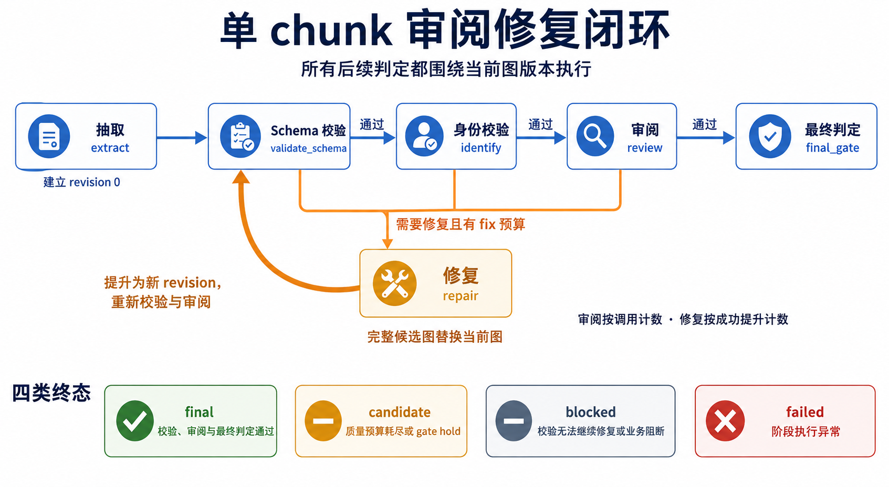

# Extraction Runtime 架构

Extraction Runtime 是一个实验性的抽取执行框架，负责把准备好的文本块转换为经过校验和审阅的图结果。它提供统一的抽取、审阅与修复循环，并支持多个文本块并发运行；具体领域的图结构和质量标准由可替换的领域能力提供。

本文面向需要理解模块职责或扩展框架的贡献者。运行示例和测试方法见[使用说明](extraction-runtime.md)。下文将框架外负责文档和任务管理的应用称为“宿主”。

## 1. 框架围绕一次文本块抽取划分职责

当前框架位于 HugeGraph LLM 包内，以准备好的文本块、领域能力和运行预算为输入，返回图结果、结束状态和执行记录。文档读取与切分发生在进入框架之前，保存和使用图结果发生在框架返回之后。

| 模块 | 核心职责 | 与其他模块的协作 |
| --- | --- | --- |
| 执行引擎 | 推进阶段，控制审阅修复循环和预算 | 调用领域能力，更新图状态，组织运行结果 |
| 领域能力 | 定义抽取、结构与身份校验、审阅、修复和最终判定规则 | 接收当前图和上下文，返回阶段结果；按需调用模型 |
| 图状态 | 维护当前图快照和版本 | 接受完整修复图，为后续判定提供一致的图版本 |
| 模型交互 | 分开请求适配与实际执行 | 将领域请求转换为模型可接受的请求，再返回响应 |
| 结果与执行记录 | 绑定图、结束状态、预算、轨迹和指纹 | 向调用方交付内存数据，由宿主决定如何保存和使用 |
| 批量执行 | 组合多个独立文本块的运行 | 控制同时运行数量，按输入顺序汇总结果 |

这种划分使领域扩展主要落在规则与模型交互上，流程推进和图版本管理由框架统一负责。[执行与领域边界](../src/hugegraph_llm/extraction_runtime/v1/engine.py) · [图状态](../src/hugegraph_llm/extraction_runtime/v1/graph_state.py) · [模型交互](../src/hugegraph_llm/extraction_runtime/provider/contracts.py) · [批量执行](../src/hugegraph_llm/extraction_runtime/v1/batch.py)

## 2. 审阅和修复始终围绕当前图版本进行

一次运行依次经过抽取、图结构校验、实体身份校验、审阅和最终判定。结构校验检查领域图是否符合约定，身份校验检查实体标识是否一致，审阅判断质量是否达到要求，最终判定决定是否接受结果。

需要修复时，领域能力提交一份完整候选图，并指明它基于哪个旧版本生成。框架接受候选图后推进版本，再从结构校验开始执行。内核不负责应用局部图补丁；审阅和最终判定必须对应当前图，避免旧结论被用于新结果。[执行循环](../src/hugegraph_llm/extraction_runtime/v1/engine.py) · [图版本管理](../src/hugegraph_llm/extraction_runtime/v1/graph_state.py)

审阅次数和修复次数分别受预算约束。审阅按调用次数计数，修复在候选图成功替换当前图后计数；每个文本块使用独立预算。具体质量分数、问题台账或增量审阅策略由领域能力自行实现，框架不预设这些业务规则。[预算管理](../src/hugegraph_llm/extraction_runtime/v1/review_loop.py)

## 3. 返回结果表达抽取结论与执行依据

| 结束状态 | 含义 |
| --- | --- |
| 通过 | 当前图通过结构、身份、审阅和最终判定 |
| 候选 | 结构与身份检查已通过，但质量预算耗尽或最终判定要求暂缓接受 |
| 阻断 | 必要校验在修复预算内未能通过，或审阅、最终判定明确拒绝接受 |
| 失败 | 执行或结果构造发生异常，可能没有可用图 |

结束状态与对应图版本绑定。调用方还可以获得预算使用情况、执行轨迹、诊断信息、指纹和产物数据。框架返回这些数据时，不会自动保存文件或写入 HugeGraph；“通过”只表示抽取结果被接受。[终态规则](../src/hugegraph_llm/extraction_runtime/v1/terminal.py) · [产物组织](../src/hugegraph_llm/extraction_runtime/v1/artifacts.py)

指纹标识本次运行依赖的条件，分别组合运行时、领域、模型、输入和可选任务计划。领域接入方声明提示词、图结构及规则的摘要，便于区分结果变化来自哪一层；框架不会自动扫描业务资源，声明需要与实际执行保持一致。[语义声明](../src/hugegraph_llm/extraction_runtime/v1/manifest.py) · [分层指纹](../src/hugegraph_llm/extraction_runtime/v1/fingerprint.py)

## 4. 并发组合保持单块执行的边界

批量执行通过线程池限制同时运行的文本块数量。每个文本块创建独立的领域能力和运行参数，各自完成抽取循环，最后按输入顺序返回结果。某个文本块以失败状态结束时，其余文本块的结果仍会保留。[批量执行](../src/hugegraph_llm/extraction_runtime/v1/batch.py)

当前批量接口面向有限批次，会整批提交任务并保留结果。它不合并跨块图、不执行跨块实体消歧，也不管理持久化恢复。准备领域能力或遍历输入时发生的错误会直接返回给调用方，区别于抽取过程产生的失败状态。使用约定见[并发说明](extraction-runtime.md#concurrent-chunks)。

## 5. 扩展从领域、模型和宿主三个位置接入

- **领域扩展**提供提示词、图结构、身份规则和质量策略，遵守统一阶段约定。当前库存领域示例展示了完整接入方式，可作为新领域的实现与测试参考。[库存领域示例](../src/hugegraph_llm/extraction_runtime/conformance/inventory.py)
- **模型扩展**适配请求能力并实现真实调用，将响应转换为领域图。目前已有确定性回放实现，真实模型客户端尚未接入本框架。[模型交互约定](../src/hugegraph_llm/extraction_runtime/provider/contracts.py) · [回放实现](../src/hugegraph_llm/extraction_runtime/provider/replay.py)
- **宿主扩展**准备文档和文本块，管理执行资源，并承接结果保存、任务恢复、跨块合并及发布。当前框架以程序调用方式供实验使用，尚未接入现有生产接口。

这些接口仍处于实验阶段。当前验证范围包括执行循环、修复图传播、终态、模型回放和并发独立性；真实模型抽取质量及完整应用集成需要另外验证。运行方法与扩展指引见[使用说明](extraction-runtime.md)，现有验证行为见[运行时测试](../src/tests/extraction_runtime)。
