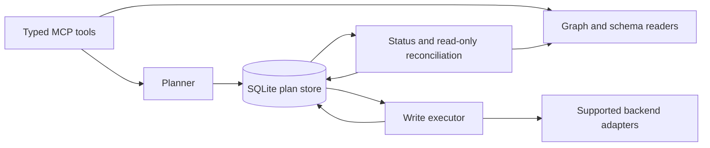

# Architecture and Roadmap

HugeGraph MCP provides structured graph inspection and queries, schema-aware
write previews, and a durable confirmation protocol. See the [README](../README.md)
for installation, tools, configuration, and the public write contract.

## Components

- **Tools and planners** validate schemas, resolve stable backend IDs, and build
  immutable plans. A write uses the targets approved during preview; it does not
  re-evaluate mutable property predicates. Unsupported writes return previews
  without an executable `plan_id`.
- **Plan store** persists the approved payload, ordered operations, dependencies,
  attempts, and receipts. Confirmation loads this payload by `plan_id`; caller
  resubmission cannot change it. SQLite supports one write-capable MCP instance.
  Legacy consumed confirmations without reliable receipts migrate to an unknown
  outcome rather than being treated as success or rejection.
- **Executor** validates adapter availability before claiming a plan. Durable
  leases, owner tokens, and per-attempt fencing protect claims and receipt writes
  against concurrent confirmation and stale workers. Repeated confirmation
  returns recorded state without issuing another write.
- **Reconciliation** reads backend state and updates receipts. It never repeats
  a mutation. Seeing the expected state after a dispatched request does not
  prove that the old request cannot commit later.

Backend IDs represent logical identity. A deployment requiring protection
against delete-and-recreate with the same ID needs a backend-enforced version
check; a process-local lock cannot supply that guarantee.

## Current Capability Boundaries

| Operation | Current behavior | Requirement for broader support |
|---|---|---|
| Structured graph/schema reads | Available with bounded inputs and output guards | Backend execution budgets remain separate |
| Schema creation | One property key, vertex label, or edge label per confirmed plan | Additional schema operations need explicit adapters and outcome verification |
| Exact edge deletion | Confirmable using a persisted edge ID | Other backend profiles require verification |
| Vertex/edge creation and graph import | Preview-only | Atomic create-if-absent and stable edge identity |
| Property mutation | Preview-only | Backend compare-and-set of expected and desired state |
| Isolated vertex deletion | Preview-only | Atomic enforcement of the no-incident-edge precondition |
| Raw Gremlin execution | Disabled, including admin mode | Read-only principal, server evaluation timeout and result cap, and streaming response-byte limit |

Capability evidence is specific to server version and storage backend. Unknown
profiles stay disabled. HugeGraph 1.7.0/RocksDB does not provide verified atomic
creation or property CAS through the current client. Its isolated-delete
concurrency probe can remove a concurrently added edge, so a successful ordered
test is insufficient to enable that operation. See
[`backend_capabilities.py`](../hugegraph_mcp/backend_capabilities.py) and
[`test_real_write_path.py`](../tests/integration/test_real_write_path.py).

Output item/byte checks run after response materialization. They bound MCP
output, not server work, network transfer, or parsing memory. Connection, read,
write, and AI timeouts are configured separately.

## Durable Outcomes

| Status | Meaning |
|---|---|
| `APPLIED` / `ALREADY_APPLIED` | Desired state is proven, or was already present for the operation |
| `REJECTED` | The backend proves no mutation occurred |
| `CONFLICT` | The approved precondition no longer holds |
| `PARTIAL` | Some operations succeeded and the complete workflow did not |
| `UNKNOWN` | A commit may have occurred, but its outcome is unproven |

Schema manager construction, request, response parsing, and verification share
one ambiguity boundary. Transport errors never by themselves prove rejection.
Crash recovery exposes unfinished execution as unknown. Reconciliation can mark
an operation retryable only when its durable record proves it was never claimed;
claimed requests remain unknown while an in-flight commit cannot be excluded.
Internal resume skips completed operations and requires that evidence. There is
no public resume tool or automatic replay of `PARTIAL`/`UNKNOWN` writes.

## Next Work

1. **Complete distribution validation.** Publish client and MCP `1.7.1`, verify
   installation from the public index, and exercise a real HugeGraph service.
   For the planned release, align package versions to `1.8.0` and raise the MCP
   client dependency accordingly. Follow the [publishing guide](releasing.md).
2. **Enable additional writes only with backend support.** Add the atomic
   primitives listed above and prove them with two-client concurrency tests for
   each supported backend. Imports must preserve operation dependencies,
   returned vertex IDs, and explicit partial outcomes.
3. **Support multiple write instances.** Implement a shared transactional
   `PlanStore` with the same claim and fencing guarantees before enabling that
   topology. Define receipt retention without silently discarding unresolved
   `UNKNOWN` or `PARTIAL` records.
4. **Complete protocol migration.** Retire the all-or-nothing legacy
   `plan_hash`/`nonce`/`expires_at` locator after its documented compatibility
   release; keep new integrations on plan-ID tools.
5. **Extend query execution deliberately.** Keep raw execution disabled until
   all hard-budget requirements are enforced. Add MCP to the workspace type-check
   gate once its baseline is established.

Use the [integration checklist](integration.md) for real-server acceptance.
Changes to write behavior also require migration, fault-injection, and
concurrency tests that assert backend data and durable receipts together.
